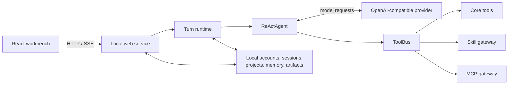

<div align="center">

# Work Agent

### A local-first AI workbench for real file-based work

Bring conversations, project files, Skills, models, and Word / PDF / PPTX / XLSX deliverables into one observable and extensible workflow.

[](https://www.python.org/)
[](https://react.dev/)
[](#data-and-security-boundary)
[](LICENSE)

[简体中文](README.md) · [Architecture (Chinese)](docs/architecture.zh-CN.md) · [Contributing](CONTRIBUTING.md) · [Security](SECURITY.md)

</div>


## What is Work Agent?

Work Agent is a local AI workbench. It goes beyond a chat wrapper: a bounded agent can read files, call tools, execute reusable Skills, maintain project context, and deliver actual office artifacts.

Typical workflows include:

- turning recordings, transcripts, and reference materials into conservative meeting minutes;
- keeping files, conversations, memory, and milestones together for a long-running project;
- handling Word, PDF, presentation, spreadsheet, and structured research tasks in one UI;
- configuring multiple OpenAI-compatible model profiles while keeping model selection manual;
- observing activity, tool calls, approvals, artifacts, and debug traces during execution.

> **Local-first does not mean fully offline.** Accounts, configuration, project material, conversations, and generated files stay local by default. Content sent to a configured model provider is still governed by that provider's privacy policy.

## Highlights

| Area | Capability |
| --- | --- |
| Agent workbench | Streaming conversations, bounded ReAct execution, task plans, cancellation, recovery, and history continuation |
| Projects | Project-scoped conversations and files, instructions, grouped sources, timelines, and cross-chat context |
| Tools and Skills | Core tools, repository Skills, and optional MCP stdio services mounted behind one `ToolBus` |
| Office artifacts | Read, generate, and preview Word, PDF, PowerPoint, and Excel files |
| Meetings and voice | Audio preprocessing, optional local Qwen3-ASR / MLX transcription, realtime voice input, and meeting archives |
| Models | Multiple OpenAI-compatible profiles with connection tests, discovery, and manual selection |
| Control and observability | SSE activity, persisted turns, cancellation, approval recovery, local JSONL traces, and artifact archives |
| Isolation | SQLite authentication plus per-account workspaces, settings, and conversation data |

## Architecture at a glance



Work Agent is currently a bounded **single-agent execution workbench**, not a multi-agent orchestration platform or a public hosted SaaS. See the [Chinese architecture guide](docs/architecture.zh-CN.md) for component responsibilities and data boundaries.

## Quick start

The maintained setup is macOS with Python 3.12, Node.js, and npm. FFmpeg, LibreOffice, and local MLX / ASR models are optional.

```bash
git clone https://github.com/Alianess/work-agent.git
cd work-agent

cp .env.example .env
cp config/model_profiles.example.json config/model_profiles.json
cp config/agent_settings.example.json config/agent_settings.json
cp config/asr_settings.example.json config/asr_settings.json
cp config/mcp_servers.example.json config/mcp_servers.json

scripts/runtime_env.sh bootstrap
npm --prefix web_frontend install
npm --prefix web_frontend run build

.venv/bin/python -m work_agent_core.web_server \
  --host 127.0.0.1 \
  --port 8787 \
  --workspace "$PWD" \
  --static-dir web_frontend/dist
```

Before the first start, edit `.env` to set a strong administrator password and a model API key. Update `config/model_profiles.json` so `api_key_env` points to that environment variable. Then open [http://127.0.0.1:8787](http://127.0.0.1:8787).

For managed local operation on macOS:

```bash
scripts/work_agent_service_ctl.sh install
```

## Data and security boundary

Never commit these local files:

- `.env` and real API credentials;
- `config/model_profiles.json` and `config/auth.sqlite3`;
- `meet_files/`, including conversations, projects, uploads, memory, traces, and generated artifacts;
- `meeting_audio_minutes/model_cache/` and downloaded models.

Safe templates are provided as `.env.example` and `config/*.example.json`. The service binds to `127.0.0.1` by default. Read [SECURITY.md](SECURITY.md) before any remote deployment.

## Development checks

```bash
scripts/runtime_env.sh check
.venv/bin/python -m pip check
.venv/bin/python -m unittest discover -s tests -p 'test_*.py'
npm --prefix web_frontend run build
curl -fsS http://127.0.0.1:8787/api/health
```

Contributions are welcome. Please read [CONTRIBUTING.md](CONTRIBUTING.md) before opening a pull request.

## License

Original Work Agent code is released under the [MIT License](LICENSE). See [NOTICE](NOTICE) for third-party components and redistribution notes.
