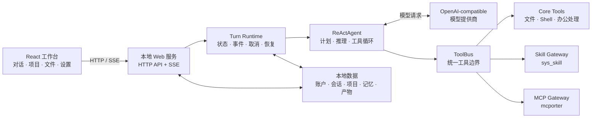

<div align="center">

# Work Agent

### 本地优先、面向真实文件工作的 AI 工作台

把对话、项目资料、Skills、模型与 Word / PDF / PPTX / XLSX 产物，放进同一个可观察、可中断、可扩展的工作流。

[](https://www.python.org/)
[](https://react.dev/)
[](#数据与安全边界)
[](#运行环境)
[](LICENSE)

[English](README.en.md) · [架构详解](docs/architecture.zh-CN.md) · [参与贡献](CONTRIBUTING.md) · [安全说明](SECURITY.md)

</div>


## Work Agent 是什么

Work Agent 是一个运行在本机的 AI 工作台。它不是只会聊天的网页壳，而是让模型在明确边界内读取文件、调用工具、执行 Skill、维护项目上下文，并把结果交付为真实工作文件。

它尤其适合这类任务：

- 从录音、转写稿和补充材料中生成保守、可核验的会议纪要；
- 围绕一个长期项目持续积累文件、对话、记忆和关键节点；
- 用同一套工作台处理 Word、PDF、演示文稿、表格与研究任务；
- 接入不同的 OpenAI-compatible 模型，同时由用户手动决定当前模型；
- 在执行过程中查看进度、工具调用、审批、产物和调试 Trace。

> **Local-first 不等于完全离线。** 账户、配置、项目资料、会话和生成文件默认保存在本机；发送给模型提供商的内容仍受你所配置服务的隐私政策约束。本地 ASR 等能力可按需使用。

## 核心能力

| 能力 | 现在可以做什么 |
| --- | --- |
| **智能体工作台** | 流式对话、ReAct 工具执行、执行计划、停止当前轮、失败恢复与历史续接 |
| **项目工作流** | 按项目组织对话与文件，维护项目指令、资料分组、时间线和跨会话上下文 |
| **Skills 与工具** | 内置工具、仓库级 Skills、可选 MCP stdio 服务统一挂到 `ToolBus` |
| **办公文件** | 读取、生成与预览 Word、PDF、PowerPoint、Excel 等常见办公产物 |
| **会议与语音** | 音频预处理、Qwen3-ASR / MLX 可选本地转写、实时语音输入、会议档案 |
| **模型管理** | 配置多个 OpenAI-compatible profile，连接测试、模型发现与手动切换 |
| **可观察与可控** | SSE 活动流、Turn 状态、取消、审批恢复、本地 JSONL Trace 与产物归档 |
| **账户隔离** | SQLite 登录会话、普通账户独立工作区、独立设置与独立会话数据 |

## 架构一览



一次对话并不是“请求发出后等一个最终答案”：服务端会创建可持久化的 Turn，持续发送活动事件；`ReActAgent` 在最多 50 轮的边界内调用模型与工具；需要敏感操作时进入审批；刷新或中断后，前端仍可依据 Turn 事件恢复状态。

更完整的组件职责、数据流、账户隔离和扩展方式见 [《架构详解》](docs/architecture.zh-CN.md)。

## 快速开始

### 运行环境

目前持续维护和验证的环境是：

- macOS；
- Python 3.12（Apple Silicon 推荐 Homebrew Python）；
- Node.js 与 npm；
- 可选：FFmpeg、LibreOffice、本地 MLX / ASR 模型。

后端和前端也可以在其他平台手动启动，但 `launchd` 服务脚本与部分本地模型能力是 macOS 导向的。

### 1. 获取代码

```bash
git clone https://github.com/Alianess/work-agent.git
cd work-agent
```

### 2. 创建本地配置

真实密钥和个人数据文件都已被 Git 忽略：

```bash
cp .env.example .env
cp config/model_profiles.example.json config/model_profiles.json
cp config/agent_settings.example.json config/agent_settings.json
cp config/asr_settings.example.json config/asr_settings.json
cp config/mcp_servers.example.json config/mcp_servers.json
```

然后至少完成三项设置：

1. 在 `.env` 中设置一个不少于 8 位的首次管理员密码；
2. 设置 `WORK_AGENT_INVITE_CODE`，只有持有该邀请码的人才能注册普通账户；未配置时关闭新用户注册；
3. 设置模型 API Key，并让 `config/model_profiles.json` 的 `api_key_env` 指向对应环境变量。

新安装不会创建弱默认账户。模型 profile 由用户手动选择，运行时不会擅自替你更换到另一个模型。

### 3. 安装依赖并构建前端

```bash
scripts/runtime_env.sh bootstrap
npm --prefix web_frontend install
npm --prefix web_frontend run build
```

根目录 `.venv` 是项目支持的唯一 Python 运行环境；`scripts/runtime_env.sh check` 会检查解释器与关键依赖是否一致。

### 4. 启动

```bash
.venv/bin/python -m work_agent_core.web_server \
  --host 127.0.0.1 \
  --port 8787 \
  --workspace "$PWD" \
  --static-dir web_frontend/dist
```

浏览器打开 [http://127.0.0.1:8787](http://127.0.0.1:8787)。

macOS 也可以安装本机 `launchd` 服务：

```bash
scripts/work_agent_service_ctl.sh install
```

脚本会从模板生成一份带本机绝对路径、且已被 Git 忽略的 plist。查看状态与日志：

```bash
scripts/work_agent_service_ctl.sh status
scripts/work_agent_service_ctl.sh logs
scripts/work_agent_service_ctl.sh errors
```

## 数据与安全边界

| 内容 | 默认位置 | 是否应提交 |
| --- | --- | --- |
| API Key、首次管理员凭据 | `.env` | **否** |
| 模型端点与当前模型 | `config/model_profiles.json` | **否** |
| 账户与登录会话 | `config/auth.sqlite3` | **否** |
| 用户设置与个人工作背景 | `meet_files/users/u<id>/` | **否** |
| 会话、项目、记忆、上传与生成文件 | `meet_files/` | **否** |
| 调试 Trace 与临时同步文件 | `meet_files/debug_traces/` 等 | **否** |
| 下载的本地模型 | `meeting_audio_minutes/model_cache/` | **否** |
| 安全配置模板 | `.env.example`、`config/*.example.json` | 是 |

服务默认只监听 `127.0.0.1`。不要把内置 HTTP 服务直接暴露到公网；如需远程访问，请先阅读 [SECURITY.md](SECURITY.md)，并在可信反向代理、TLS 和额外访问控制之后部署。

## 项目结构

```text
work-agent/
├── work_agent_core/          # Web 服务、ReAct、模型、工具、账户与持久化
├── web_frontend/             # React + Vite 工作台
├── work_agent_skills/        # 仓库级可复用 Skills
├── meeting_audio_minutes/    # 会议转写与纪要工作流
├── config/                   # 可公开的示例配置；真实配置不入库
├── scripts/                  # 运行环境、服务与维护脚本
├── tests/                    # 后端与工作流回归测试
└── docs/                     # 架构与项目图片
```

关键实现入口：

- [`work_agent_core/web_server.py`](work_agent_core/web_server.py)：HTTP API、SSE 与账户工作区路由；
- [`work_agent_core/react.py`](work_agent_core/react.py)：有边界的单智能体 ReAct 循环；
- [`work_agent_core/tool_bus.py`](work_agent_core/tool_bus.py)：统一工具面与 provider 边界；
- [`work_agent_core/skill_gateway.py`](work_agent_core/skill_gateway.py)：Skill 发现、打开与调用；
- [`web_frontend/src/App.tsx`](web_frontend/src/App.tsx)：工作台主要交互与页面状态。

## 开发与验证

```bash
scripts/runtime_env.sh check
.venv/bin/python -m pip check
.venv/bin/python -m unittest discover -s tests -p 'test_*.py'
npm --prefix web_frontend run build
curl -fsS http://127.0.0.1:8787/api/health
```

欢迎提交问题和改进。开始前请阅读 [CONTRIBUTING.md](CONTRIBUTING.md)；涉及安全问题时，请不要创建公开 Issue，改按 [SECURITY.md](SECURITY.md) 中的方式报告。

## 项目边界

Work Agent 当前是一个本地优先的**单智能体执行工作台**，不是多智能体编排平台，也不是面向公网的托管 SaaS。它的重点是把一个 Agent 的模型、工具、Skill、文件、审批、记忆和产物链路做扎实，并为后续能力保留清晰接口。

## License

Work Agent 原创代码采用 [MIT License](LICENSE)。仓库中包含或引用的第三方组件可能有不同条款，重新分发前请同时阅读 [NOTICE](NOTICE)。
