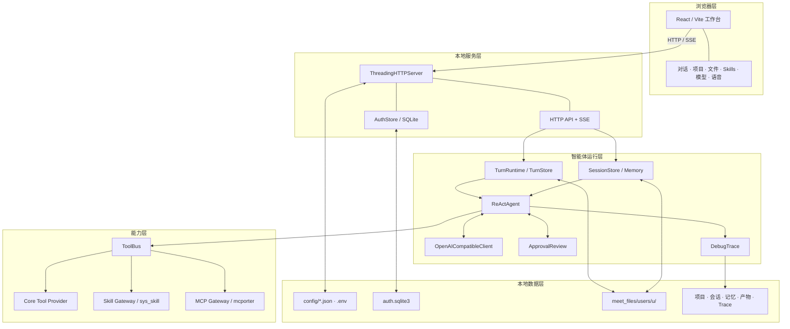
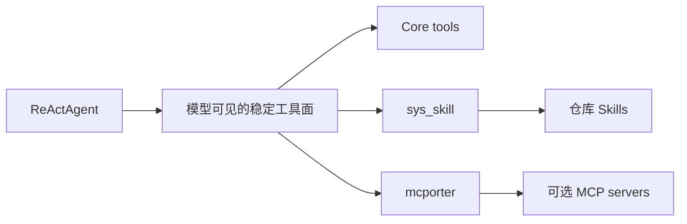
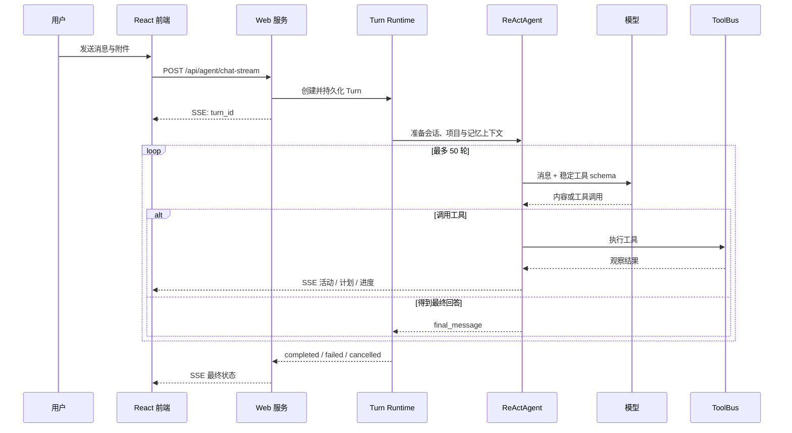

# Work Agent 架构详解

这份文档解释 Work Agent 当前代码的真实边界、一次请求的运行链路、数据如何落盘，以及新增模型、工具和 Skill 时应该接在哪一层。

## 1. 设计目标

Work Agent 主要解决四个问题：

1. **让模型真正处理本地工作材料**，而不只是生成一段聊天文本；
2. **让一次执行可观察、可取消、可恢复**，而不是不可见的长请求；
3. **把工具、Skill 与 MCP 分层挂载**，避免所有能力互相耦合；
4. **把源代码、密钥、账户数据和工作产物分开**，让仓库可以公开、数据仍留在本机。

当前系统是单进程本地 Web 服务加一个 React 前端。一次用户请求会运行一个有明确步数上限的单 `ReActAgent`。它不是多智能体任务图，也不会自动创建其他 Agent。

## 2. 系统组件



### 浏览器层

`web_frontend/` 是 React + Vite 单页工作台。它负责：

- 登录、导航、模型和设置管理；
- 对话输入、文件附件、项目上下文与 Skill 选择；
- 消费 SSE 流并把活动、计划、工具执行、审批和最终回答分开渲染；
- 根据 `turn_id` 拉取遗漏事件，在刷新后恢复当前轮状态；
- 浏览文件、会议档案、项目资料、时间线、记忆和生成产物。

前端不持有模型密钥。API Key 的值由后端写入本机 `.env`，前端只显示配置状态。

### 本地服务层

`work_agent_core/web_server.py` 基于 Python 标准库 `ThreadingHTTPServer` 提供静态文件、JSON API 与 SSE。它也是账户工作区边界的入口：

- 管理员可以使用仓库工作区；
- 普通账户被限制在 `meet_files/users/u<id>/workspace/`；
- 每个账户分别维护设置、会话、项目、记忆、通知和通道状态。

服务默认绑定 `127.0.0.1`。它没有把自身设计成直接暴露公网的应用服务器。

### 智能体运行层

`work_agent_core/react.py` 中的 `ReActAgent` 负责模型与工具循环。默认最多执行 50 轮，服务端还会把传入上限约束在 1–60 之间。

运行时的重要配套组件包括：

- `TurnRuntime`：管理当前轮的状态、事件、取消与运行中实例；
- `TurnStore`：把 Turn 元数据和活动事件持久化；
- `SessionStore`：保存对话消息和项目关联；
- `memory.py`：在上下文接近阈值时整理会话记忆；
- `CrossChatMemoryStore`：保存可检索的跨会话记忆；
- `ApprovalReview`：处理需要授权的本地动作；
- `DebugTrace`：写入脱敏后的 JSONL 运行摘要。

### 能力层

`ToolBus` 是 Agent 与所有能力之间的稳定接口。Provider 按顺序挂载，发生同名工具时由先挂载者拥有该名称，确保模型看到的 schema 是确定的。



Skill 和 MCP provider 的全部底层工具不会一次性塞进模型上下文。Agent 先通过 `sys_skill` 或 `mcporter` 查看并按需调用，这样可以控制 schema 体积，也让后端保持可替换。

## 3. 一次请求如何运行



几个关键点：

- 模型输出了文本并不一定代表结束；只要同一响应里还有可解析的工具调用，运行就会继续；
- 停止按钮先向服务端请求取消，再中断浏览器的 SSE，避免“界面停了但后端还在跑”；
- 活动事件带递增索引，刷新后可以从最后位置继续获取；
- 工具需要额外权限时，Turn 会保存待审批状态，审批后从同一上下文恢复；
- Trace 记录步骤、耗时、工具名和脱敏摘要，不记录 API Key。

## 4. 数据与账户隔离

### 配置与密钥

| 类型 | 位置 | 说明 |
| --- | --- | --- |
| 模型密钥、首次管理员凭据 | `.env` | 只在后端读取，不入库 |
| 模型 profile | `config/model_profiles.json` | 本机配置，不入库 |
| ASR / MCP / Agent 设置 | `config/*.json` | 真实文件不入库，只提交 example |
| 账户与 Session | `config/auth.sqlite3` | SQLite，本机数据 |

### 用户工作数据

普通账户的数据根位于：

```text
meet_files/users/u<id>/
├── workspace/                 # 该账户可见的文件工作区
├── conversation_history/      # 会话与 Turn
├── projects/                  # 项目元数据与资料
├── agent_settings.json        # 个人工作背景与偏好
├── notifications.json         # 通知
└── channels/                  # 可选外部通道状态
```

管理员保持对仓库工作区的访问能力，普通账户则通过 `account_workspace_root()` 被收敛到自己的目录。新增文件 API 或 Skill 时，必须继续使用账户工作区解析，不能直接信任浏览器传入的绝对路径。

## 5. 关键代码地图

| 路径 | 职责 |
| --- | --- |
| `work_agent_core/web_server.py` | HTTP / SSE、路由、账户工作区、工作流编排入口 |
| `work_agent_core/react.py` | 单 Agent ReAct 循环、流式事件、恢复与终止契约 |
| `work_agent_core/llm.py` | OpenAI-compatible 请求、流式解析与代理路由 |
| `work_agent_core/tool_bus.py` | Provider 挂载、工具名归属与模型工具面 |
| `work_agent_core/skill_gateway.py` | Skill 列表、说明、打开与调用 |
| `work_agent_core/mcp_gateway.py` | MCP 配置、进程与调用边界 |
| `work_agent_core/session_store.py` | 对话消息持久化与修复 |
| `work_agent_core/turn_runtime.py` | 运行中 Turn、事件与取消 |
| `work_agent_core/turn_store.py` | Turn 落盘与恢复 |
| `work_agent_core/cross_chat_memory.py` | 跨会话记忆与检索 |
| `work_agent_core/auth.py` | SQLite 账户、密码与 Session |
| `web_frontend/src/App.tsx` | 工作台主状态与界面交互 |
| `web_frontend/src/api.ts` | 前端 API / SSE 客户端 |

## 6. 扩展方式

### 新增模型

在本机 `config/model_profiles.json` 增加 OpenAI-compatible profile，并让 `api_key_env` 指向 `.env` 中的环境变量。不要在 JSON 或前端代码里保存真实 Key。

### 新增仓库 Skill

在 `work_agent_skills/<skill-id>/` 中至少提供：

```text
SKILL.md
work_agent.json
```

`SKILL.md` 描述模型应遵循的工作流，`work_agent.json` 声明运行依赖和可调用工具。Skill 应通过工作区边界访问文件，并把最终产物返回为可发现的文件路径。

### 新增本地工具

核心、低成本且需要稳定出现在模型 schema 中的能力可以注册为 Core Tool；领域能力优先放入 Skill；外部进程或独立服务优先通过 MCP 接入。不要为了方便把全部工具 schema 永久塞进模型上下文。

### 新增外部通道

通道应适配 `ChannelMessage` / `ChannelReply`，复用账户、会话、Turn 与 Agent 运行时，不另起一套没有隔离和 Trace 的执行链路。

## 7. 当前边界与非目标

- **不是多智能体编排器**：Turn 表示一轮单 Agent 执行，不是任务 DAG；
- **不是默认离线模型**：模型请求会发送到用户配置的服务，本地 ASR 是可选能力；
- **不是公网应用服务器**：默认只在回环地址运行；
- **不自动替用户切换模型**：profile 的选择属于显式配置；
- **不把本地工作数据当成源码**：`meet_files/`、真实配置、缓存和密钥必须保持未跟踪。

这些边界让 Work Agent 可以专注于一件事：把单个 AI Worker 的文件、工具、记忆、审批、观察与交付链路做稳。
