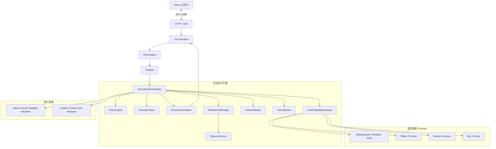
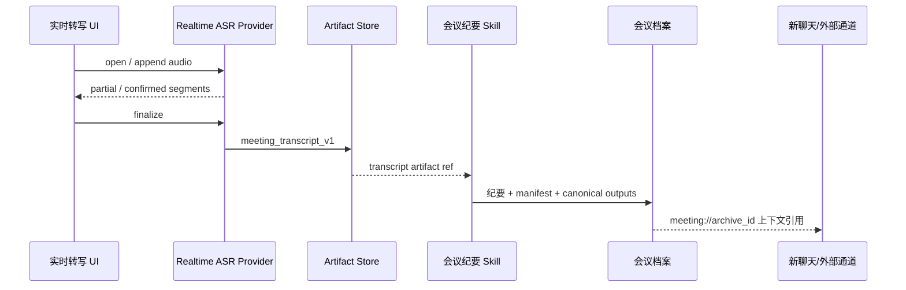
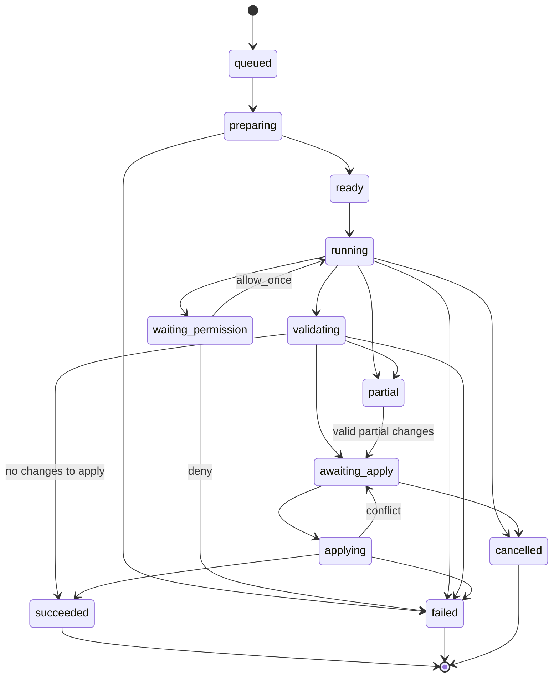

# Work Agent 安全执行平台开发设计

> 状态：设计已确认；第一阶段基础设施已实现，剩余宿主能力网关、受控网络代理和完整 API 按本文件继续收敛
> 面向读者：产品、后端、前端、安全、测试、Skill 开发者
> 适用范围：Work Agent 本地 Web 工作台、Core Tools、Skills、MCP、会议 ASR、Office 和未来自动化任务
> 设计原则：目标态优先，不以保留现有宿主直执行为前提；迁移期间允许兼容适配，但最终必须收敛到统一执行平面

## 1. 文档目的

这份文档定义 Work Agent 的目标态安全执行平台，包括产品契约、信任边界、模块职责、Python 接口、HTTP/SSE 协议、数据模型、权限系统、工作区交付、网络和凭据、宿主能力、状态恢复、前端交互、测试体系与迁移门槛。

实施完成后，系统必须能够准确回答以下问题：

1. 一次工具调用在哪里执行；
2. 执行环境能够读取、写入和联网到哪里；
3. 哪些权限来自固定策略，哪些权限来自用户授权；
4. 进程、子进程和长期服务如何停止；
5. 哪些文件是临时结果，哪些修改已经写回真实工作区；
6. 任务失败、重启或断线后从哪里恢复；
7. 系统说“完成”时，产物是否真实存在并经过验证；
8. 会议 ASR、Office、麦克风等宿主能力如何在不开放任意宿主 Shell 的前提下使用。

### 当前实现状态（2026-08-03）

| 能力 | 当前状态 | 约束与后续收敛 |
| --- | --- | --- |
| 执行记录、事件、权限、回执 | 已实现 | SQLite 账户隔离存储，回执同时原子写入文件；已提供账户范围的记录、事件、变更集和回执查询接口，待补充独立审批、取消与写回操作接口。 |
| 私有快照、变更集、验证、原子写回 | 已实现 | 快照有文件数、体积和录音/缓存排除上限，避免递归复制大工作区；大范围任务须显式缩小 `cwd`。 |
| 原生 macOS Seatbelt | 已实现，生产失败关闭 | 不使用 Docker；本开发会话的上层沙箱不允许验证 `sandbox-exec`，需在真实服务进程做边界验收，失败时绝不回退宿主。 |
| 进程取消与资源限制 | 已实现 | ReAct Turn 的取消信号已传到执行进程组；后续宿主能力服务需要共享同一 Lease/取消协议。 |
| 会议实时 ASR → 纪要/新聊天 | 已实现复用链路 | 实时文本先保存为标准会议转写，再直接调用现有 `meeting-minutes` Skill；不重新转写、不复制纪要生成逻辑。 |
| Office、ASR、麦克风宿主能力网关 | 进行中 | 现有业务能力仍在受控的既有 Skill 路径；下一阶段将替换为统一 HostCapabilityGateway。 |
| 网络代理与凭据代理 | 未启用，失败关闭 | 请求域名权限会持久化；没有受控代理时返回 `NETWORK_BROKER_UNAVAILABLE`，不会开放普通网络。 |

## 2. 核心产品决策

以下决策是本设计的固定前提。

### 2.1 默认执行环境

- 任意代码、Shell、项目构建、测试和 Skill 脚本默认在隔离环境执行；
- 目标默认后端为原生 macOS Seatbelt，配合 Python 进程组、资源限制、私有快照与原子写回；
- 不引入 Docker、常驻虚拟机或桌面守护进程；
- 宿主直接执行只允许通过明确的“宿主执行”模式或受信宿主能力服务；
- 隔离后端不可用时失败关闭，不得自动切换为宿主执行。

### 2.2 用户可见模式

用户侧只提供两个模式：

| 模式 | 默认 | 产品含义 |
| --- | --- | --- |
| 隔离执行 | 是 | 在受限环境中运行，默认不读取项目外文件、不持有宿主凭据、网络按策略开放 |
| 宿主执行 | 否 | 直接使用本机环境，只能由用户明确选择或批准，模型不得自行切换 |

持久环境、后端类型、快照策略等属于高级实现配置，不增加普通用户的认知负担。

### 2.3 执行三通道

所有工具必须归入以下一种执行类别：

1. **进程内可信工具**：纯计算、受工作区解析器约束的文件操作；
2. **隔离执行任务**：任意代码、命令、构建、测试、Skill 脚本和不受信依赖；
3. **宿主能力服务**：ASR、麦克风、Apple Metal、Office、本机浏览器登录态等必须访问宿主资源的能力。

不得出现第四条绕过执行平台的隐藏子进程路径。

### 2.4 审批、隔离与验收分层

- 权限系统决定“是否允许开始或扩大能力”；
- 隔离后端决定“开始后最多能做什么”；
- 验证与交付系统决定“结果是否完成并可用”。

三者必须使用独立的数据模型和状态，不能继续用一个命令退出码表达全部结果。

### 2.5 工作区交付

- 隔离任务默认操作私有快照，不直接挂载宿主工作区为可写；
- 任务结束后生成变更清单、哈希、验证结果和可视化 diff；
- 写回使用带基线哈希校验的原子事务；
- 宿主文件在任务期间发生变化时必须返回冲突，不得覆盖；
- “进程成功”不等于“修改已应用”。

### 2.6 会议能力复用

- 实时 ASR 和录音转写通过宿主能力网关提供；
- 继续复用 `check_meeting_asr_progress`、`transcribe_meeting_audio`、会议纪要 Skill 和会议档案 manifest；
- 实时录音结束后固化为标准会议转写产物，再进入现有会议纪要流程；
- 不重新实现会议纪要抽取、归档和上下文装配逻辑。

## 3. 目标与非目标

### 3.1 产品目标

1. 默认情况下，模型可以在项目范围内自主完成常规任务而不频繁打断用户；
2. 任意获批进程及其后代都不能突破文件、网络、资源和凭据边界；
3. 每次重要执行都有稳定 ID、策略版本、事件流、变更清单和最终回执；
4. 任务可取消、可恢复、可判定部分完成，不重复执行已确认的副作用；
5. 所有账户继续保持独立工作区、独立执行记录和独立产物；
6. 宿主能力通过窄接口提供，不扩大通用命令权限；
7. 前端用少量稳定组件解释执行状态，不把协议日志和命令洪流塞入聊天正文。

### 3.2 非目标

- 不把 Work Agent 变成完整桌面虚拟化产品；
- 不承诺抵御宿主内核或虚拟化平台的零日漏洞；
- 不在本阶段设计企业组织级 RBAC、审批流编排或多租户云控制面；
- 不让模型自动安装新的执行后端、修改安全策略或切换到宿主执行；
- 不把模型供应商的数据处理纳入本地沙箱保证；
- 不使用命令名称白名单作为主要安全边界；
- 不为会议 ASR、Office 或浏览器能力复制一套新的业务流程。

## 4. 当前可复用资产与需要替换的边界

### 4.1 直接复用

- `ToolBus` 的稳定工具面和 Provider 分层；
- `TurnRuntime` / `TurnStore` 的持久事件、取消和审批恢复；
- 现有账户工作区解析与普通账户数据隔离；
- `DebugTrace`、Activity、SSE 增量事件和前端恢复机制；
- 精确动作审批、一次性授权凭证和批次审批 UI；
- `WorkspaceFiles` 的路径归一化原则；
- 会议 ASR 断点、转写、会议纪要 Skill 和 manifest 归档；
- 现有 Office、文件、Skill 和 MCP 能力的业务逻辑。

### 4.2 必须替换

- `run_logged_process()` 直接调用宿主 `subprocess.Popen()` 的执行职责；
- `shell_exec` 以可执行文件名称和参数猜测风险的主边界；
- Skill Runtime、会议、Office 等模块自行启动子进程的路径；
- 把宿主 `HOME` 传递给不受信进程的环境构造；
- 超时只杀直接子进程的逻辑；
- 工具成功字符串直接驱动任务完成判断的逻辑；
- 隔离修改直接写入真实工作区的默认行为。

### 4.3 最终代码约束

完成迁移后，除以下目录外，仓库不得出现直接进程创建：

```text
work_agent_core/execution/backends/
work_agent_core/host_services/providers/
```

CI 增加静态检查，禁止其他模块使用：

```text
subprocess.Popen
subprocess.run
os.system
os.popen
pty.spawn
```

允许的测试替身必须显式标注并限制在测试目录。

## 5. 威胁模型

### 5.1 默认不可信输入

以下内容一律按不可信处理：

- 模型生成的命令和工具参数；
- 用户项目中的代码、脚本、Makefile 和安装钩子；
- 下载的依赖、压缩包和文档宏；
- Skill 包中的脚本与第三方 MCP 实现；
- 命令输出、文件名、符号链接和归档条目；
- 网页内容、会议转写文本和外部通道消息中的指令。

### 5.2 可信计算基

可信组件应尽可能小，仅包括：

- 执行编排器；
- 策略引擎；
- 后端启动器；
- 工作区快照与应用器；
- 网络代理；
- 凭据代理；
- 宿主能力网关；
- 事件和回执存储；
- 账户鉴权与工作区解析。

模型、项目代码和普通 Skill 不属于可信计算基。

### 5.3 必须防止的攻击

- 读取 `~/.ssh`、浏览器数据、其他账户工作区或其他项目；
- 通过符号链接、硬链接、路径穿越或竞态越出工作区；
- 通过 Python、Node、动态链接库或替代二进制绕过网络限制；
- 访问宿主 `localhost`、私网、云元数据地址或 Docker Socket；
- 在取消或超时后保留后台进程；
- fork bomb、磁盘写满、内存耗尽和无限输出；
- 在日志、Trace、Activity 或产物中泄漏原始凭据；
- 重放已经批准的权限或外部副作用；
- 在宿主文件改变后覆盖新内容；
- 利用恶意 stdout/SSE 内容污染前端协议。

## 6. 总体架构



### 6.1 调用原则

`ReActAgent` 和工具 handler 不直接选择具体后端。它们提交声明式 `ExecutionRequest`，由执行编排器完成：

1. 补全账户、Turn、项目和调用链上下文；
2. 生成不可变执行契约；
3. 调用策略引擎；
4. 必要时产生权限请求；
5. 创建或复用隔离环境；
6. 执行并发送事件；
7. 验证产物；
8. 生成变更和交付回执；
9. 更新 Turn 状态。

工具不能通过参数指定 `trusted_host` 来绕过策略。宿主执行模式只能来自经过鉴权的用户设置或权限决定。

## 7. 代码包结构

目标目录如下：

```text
work_agent_core/
├── execution/
│   ├── __init__.py
│   ├── models.py                 # 不可变领域对象和枚举
│   ├── context.py                # ExecutionContext / ToolExecutionContext
│   ├── orchestrator.py           # 统一编排入口
│   ├── policy.py                 # 固定策略、能力合并和授权检查
│   ├── permissions.py            # 请求、决定、一次性授权
│   ├── store.py                  # 执行、事件、权限、回执持久化
│   ├── events.py                 # 事件模型与 Turn/Activity 映射
│   ├── workspace.py              # 快照、变更检测、基线哈希
│   ├── delivery.py               # 验证、应用、回滚日志
│   ├── network.py                # 域名策略和代理会话
│   ├── secrets.py                # 凭据引用和代理注入
│   ├── validation.py             # 文件、测试和自定义验收
│   ├── receipts.py               # 用户可读与机器可读回执
│   └── backends/
│       ├── base.py
│       ├── seatbelt.py
│       └── trusted_host.py
├── host_services/
│   ├── gateway.py
│   ├── models.py
│   ├── store.py
│   └── providers/
│       ├── meeting_asr.py
│       ├── realtime_asr.py
│       ├── office.py
│       └── browser.py
└── ...
```

前端建议拆出：

```text
web_frontend/src/execution/
├── types.ts
├── api.ts
├── ExecutionBadge.tsx
├── ExecutionActivityCard.tsx
├── PermissionCard.tsx
├── ChangeReviewPanel.tsx
├── ExecutionReceipt.tsx
├── EnvironmentDetails.tsx
└── execution.css
```

不继续把全部执行交互堆入 `App.tsx`。

## 8. 核心领域模型

以下示例使用 Python 类型表达接口。实现时领域对象应可稳定序列化，不把后端私有字段暴露给 Agent。

### 8.1 枚举

```python
from enum import StrEnum


class ExecutionMode(StrEnum):
    ISOLATED = "isolated"
    TRUSTED_HOST = "trusted_host"


class BackendKind(StrEnum):
    MACOS_SEATBELT = "macos_seatbelt"
    TRUSTED_HOST = "trusted_host"


class ExecutionClass(StrEnum):
    IN_PROCESS = "in_process"
    ISOLATED_PROCESS = "isolated_process"
    HOST_SERVICE = "host_service"
    EXTERNAL_ACTION = "external_action"


class ExecutionStatus(StrEnum):
    QUEUED = "queued"
    PREPARING = "preparing"
    READY = "ready"
    RUNNING = "running"
    WAITING_PERMISSION = "waiting_permission"
    VALIDATING = "validating"
    AWAITING_APPLY = "awaiting_apply"
    APPLYING = "applying"
    SUCCEEDED = "succeeded"
    PARTIAL = "partial"
    FAILED = "failed"
    CANCELLED = "cancelled"


class EnvironmentStatus(StrEnum):
    CREATING = "creating"
    READY = "ready"
    BUSY = "busy"
    STOPPING = "stopping"
    STOPPED = "stopped"
    BROKEN = "broken"


class DeliveryStatus(StrEnum):
    NONE = "none"
    CHANGES_READY = "changes_ready"
    VALIDATED = "validated"
    CONFLICTED = "conflicted"
    APPLIED = "applied"
    REJECTED = "rejected"
    APPLY_FAILED = "apply_failed"
```

### 8.2 能力范围

```python
from dataclasses import dataclass, field


@dataclass(frozen=True)
class FilesystemScope:
    read_roots: tuple[str, ...] = ()
    write_roots: tuple[str, ...] = ()
    deny_roots: tuple[str, ...] = ()
    allow_symlinks_within_roots: bool = True
    max_written_bytes: int = 2 * 1024 * 1024 * 1024


@dataclass(frozen=True)
class NetworkScope:
    mode: str = "deny"  # deny | domain_allowlist | unrestricted
    allowed_domains: tuple[str, ...] = ()
    allowed_methods: tuple[str, ...] = ("GET", "HEAD", "POST", "PUT", "PATCH", "DELETE")
    deny_private_networks: bool = True
    deny_loopback: bool = True
    deny_link_local: bool = True
    max_bytes_in: int = 512 * 1024 * 1024
    max_bytes_out: int = 64 * 1024 * 1024


@dataclass(frozen=True)
class ResourceScope:
    wall_timeout_seconds: int = 900
    cpu_seconds: int = 600
    memory_bytes: int = 4 * 1024 * 1024 * 1024
    pids: int = 64
    open_files: int = 1024
    stdout_bytes: int = 20 * 1024 * 1024
    stderr_bytes: int = 20 * 1024 * 1024


@dataclass(frozen=True)
class SecretRef:
    name: str
    purpose: str
    delivery: str = "proxy"  # proxy | short_lived_file | env
    required: bool = True


@dataclass(frozen=True)
class CapabilitySet:
    filesystem: FilesystemScope
    network: NetworkScope
    resources: ResourceScope
    secrets: tuple[SecretRef, ...] = ()
    host_services: tuple[str, ...] = ()
    allow_background_services: bool = False
```

`unrestricted` 网络和 `env` 凭据只允许在显式宿主执行或管理员固定策略中出现，模型请求不能直接获得。

### 8.3 执行请求

```python
@dataclass(frozen=True)
class CommandSpec:
    argv: tuple[str, ...]
    cwd: str = "."
    env: dict[str, str] = field(default_factory=dict)
    stdin_text: str | None = None
    shell: bool = False


@dataclass(frozen=True)
class ValidationSpec:
    kind: str  # file_exists | file_readable | mime | json_schema | command | office_render | custom
    target: str
    options: dict[str, object] = field(default_factory=dict)
    required: bool = True


@dataclass(frozen=True)
class ExecutionRequest:
    request_id: str
    idempotency_key: str
    account_id: str
    turn_id: str
    conversation_id: str
    project_id: str
    tool_call_id: str
    tool_name: str
    execution_class: ExecutionClass
    mode: ExecutionMode
    command: CommandSpec | None
    host_service: "HostServiceCall | None"
    requested_capabilities: CapabilitySet
    validations: tuple[ValidationSpec, ...] = ()
    delivery_mode: str = "review_then_apply"
    reason: str = ""
    created_at_ms: int = 0
```

约束：

- `argv` 默认直接执行，不经 Shell 解释；
- `shell=True` 是独立高风险能力，必须由策略显式允许；
- `cwd` 是相对于执行工作区的路径，不接收宿主绝对路径；
- `env` 只能包含普通运行参数，凭据必须使用 `SecretRef`；
- `idempotency_key` 对相同工具调用重试保持稳定；
- `reason` 是用户可见用途说明，不允许包含权限结论。

### 8.4 不可变执行契约

```python
@dataclass(frozen=True)
class ExecutionContract:
    contract_id: str
    execution_id: str
    policy_version: str
    account_id: str
    project_id: str
    mode: ExecutionMode
    backend: BackendKind
    workspace_snapshot_id: str
    capabilities: CapabilitySet
    granted_permission_ids: tuple[str, ...]
    delivery_mode: str
    issued_at_ms: int
    expires_at_ms: int
    digest: str
```

契约创建后不可原地修改。权限扩大时创建新版本，并保留父契约 ID 和变更原因。

### 8.5 结果与回执

```python
@dataclass(frozen=True)
class ProcessOutcome:
    exit_code: int | None
    signal: int | None
    timed_out: bool
    cancelled: bool
    stdout_ref: str
    stderr_ref: str
    started_at_ms: int
    finished_at_ms: int


@dataclass(frozen=True)
class ValidationOutcome:
    validation_id: str
    kind: str
    target: str
    status: str  # passed | failed | skipped
    detail: str
    evidence_refs: tuple[str, ...] = ()


@dataclass(frozen=True)
class ExecutionResult:
    execution_id: str
    status: ExecutionStatus
    process: ProcessOutcome | None
    validations: tuple[ValidationOutcome, ...]
    artifact_ids: tuple[str, ...]
    change_set_id: str | None
    delivery_status: DeliveryStatus
    error: "ExecutionError | None"
    receipt_id: str
```

## 9. Tool 接口升级

### 9.1 Tool 元数据

现有 `Tool` 增加声明式执行元数据：

```python
@dataclass(frozen=True)
class ToolExecutionPolicy:
    execution_class: ExecutionClass
    default_mode: ExecutionMode = ExecutionMode.ISOLATED
    capability_template: str = "project_standard"
    host_service_name: str | None = None
    external_side_effect: bool = False
    requires_delivery_validation: bool = False


@dataclass(frozen=True)
class Tool:
    name: str
    description: str
    parameters: dict[str, object]
    handler: "ToolHandler"
    provider_id: str = "local"
    provider_kind: str = "local"
    metadata: dict[str, object] = field(default_factory=dict)
    execution_policy: ToolExecutionPolicy = field(
        default_factory=lambda: ToolExecutionPolicy(ExecutionClass.IN_PROCESS)
    )
```

模型可见 schema 不包含内部后端和权限模板，避免模型操纵安全选择。

### 9.2 ToolContext

```python
@dataclass(frozen=True)
class ToolContext:
    account_id: str
    turn_id: str
    conversation_id: str
    project_id: str
    tool_call_id: str
    workspace_ref: str
    selected_execution_mode: ExecutionMode
    cancellation: "CancellationToken"
    event_sink: "ExecutionEventSink"
    execution_client: "ExecutionClient"
    host_services: "HostCapabilityClient"


class ToolHandler(Protocol):
    def __call__(self, context: ToolContext, arguments: dict[str, object]) -> "ToolResult": ...
```

现有单参数 handler 通过 `LegacyToolAdapter` 迁移。适配器只作为迁移设施，最终 Core Tool 和 Skill Runtime 均使用 `ToolContext`。

### 9.3 统一 ToolResult

```python
@dataclass(frozen=True)
class ToolResult:
    status: str  # succeeded | partial | failed | waiting_permission
    summary: str
    content: str = ""
    execution_id: str | None = None
    artifact_refs: tuple[str, ...] = ()
    evidence_refs: tuple[str, ...] = ()
    permission_request_id: str | None = None
    error: "ExecutionError | None" = None
```

Agent 只能依据结构化状态判断成功与否，不能再解析工具返回字符串中的 `ok: true`。

## 10. 执行后端接口

### 10.1 Backend Protocol

```python
from typing import Protocol


class ExecutionBackend(Protocol):
    kind: BackendKind

    def health(self) -> "BackendHealth": ...

    def prepare(
        self,
        contract: ExecutionContract,
        *,
        workspace_path: Path,
        log_dir: Path,
    ) -> "ExecutionEnvironment": ...

    def run(
        self,
        environment: "ExecutionEnvironment",
        command: CommandSpec,
        capabilities: CapabilitySet,
        events: "ExecutionEventSink",
        cancel_check: "CancelCheck | None" = None,
    ) -> ProcessOutcome: ...

    def destroy(self, environment: "ExecutionEnvironment") -> None: ...
```

### 10.2 后端硬要求

所有隔离后端必须保证：

- 文件权限由操作系统或虚拟化边界执行，不依赖命令参数检查；
- 子进程继承同样的文件、网络和资源限制；
- 环境看不到宿主用户目录、Docker Socket 和未授权设备；
- 网络只能经过受控代理；
- 取消能够终止整个进程树或销毁环境；
- stdout/stderr 有大小上限并写入独立日志；
- 后端异常不会触发宿主执行回退；
- 环境销毁后保留必要回执，不保留明文凭据。

### 10.3 Native macOS Seatbelt Backend

Seatbelt 是本产品的默认隔离后端，不启动 Docker 守护进程或虚拟机。Python 运行时负责私有快照、进程组终止、资源上限、事件、恢复和交付；Seatbelt 负责将获批进程限制在允许的文件与网络边界。

它必须明确显示后端等级，不得向用户声称拥有独立内核。策略至少包含：

- 执行工作区读写；
- 运行时依赖只读；
- 用户主目录和其他项目拒绝；
- 网络默认拒绝；
- 临时目录独立；
- 进程组控制。

### 10.4 Trusted Host Backend

宿主后端只能在以下条件同时满足时使用：

1. 用户当前任务明确选择宿主执行；
2. 权限请求展示真实访问范围；
3. 授权绑定精确执行契约；
4. 仍然应用超时、进程组、日志脱敏和账户边界；
5. 不将授权自动继承到后续 Turn。

## 11. ExecutionOrchestrator 接口

```python
class ExecutionOrchestrator:
    async def preflight(self, request: ExecutionRequest) -> "PreflightResult": ...

    async def submit(self, request: ExecutionRequest) -> ExecutionResult: ...

    async def resume_after_permission(
        self,
        execution_id: str,
        decision: "PermissionDecision",
    ) -> ExecutionResult: ...

    async def cancel(self, execution_id: str, *, requested_by: str) -> None: ...

    async def apply_changes(
        self,
        execution_id: str,
        request: "ApplyChangesRequest",
    ) -> "ApplyChangesResult": ...

    async def discard(self, execution_id: str, *, requested_by: str) -> None: ...

    async def recover_incomplete(self) -> list["RecoveryOutcome"]: ...
```

### 11.1 preflight

`preflight()` 必须返回：

- 实际执行模式和后端；
- 工作区快照范围；
- 最终能力集合；
- 被固定策略拒绝的能力；
- 需要用户确认的权限；
- 资源上限；
- 预计交付模式；
- 是否可以自动开始。

预检不启动不受信进程，也不产生外部副作用。

### 11.2 submit

`submit()` 使用 `idempotency_key` 保证：

- 同一工具调用因 SSE 重连或审批恢复重复提交时，不创建第二次执行；
- 已完成执行直接返回保存的结果；
- 运行中执行返回现有 `execution_id`；
- 失败执行是否可重试由错误类型和明确重试请求决定；
- 外部动作不得在未知状态下自动重试。

## 12. 策略与权限系统

### 12.1 策略优先级

从高到低：

1. 固定拒绝规则；
2. 账户和工作区边界；
3. 管理员配置策略；
4. Tool 声明的能力模板；
5. 用户当前模式；
6. 当前任务的一次性授权；
7. 模型请求。

低优先级不能放宽高优先级限制。

### 12.2 能力模板

建议内置：

| 模板 | 用途 | 文件 | 网络 | 凭据 |
| --- | --- | --- | --- | --- |
| `project_readonly` | 分析、搜索、检查 | 项目快照只读 | 关闭 | 无 |
| `project_standard` | 编辑、测试、构建 | 快照读写 | 关闭 | 无 |
| `project_dependencies` | 安装声明依赖 | 快照读写 | 包仓库域名 | 代理凭据 |
| `document_render` | 文档渲染 | 输入只读、产物可写 | 关闭 | 无 |
| `meeting_processing` | 会议转写和纪要 | 会议材料与产物 | 模型按 profile | ASR 宿主服务 |
| `research_web` | 联网调研 | 项目产物可写 | 指定域名或 Web 代理 | 必要的代理凭据 |
| `trusted_host_explicit` | 明确宿主操作 | 用户批准范围 | 按批准 | 按批准 |

Tool 可请求模板，但最终能力由策略引擎收敛。

### 12.3 PermissionRequest

```python
@dataclass(frozen=True)
class PermissionRequest:
    permission_request_id: str
    execution_id: str
    contract_id: str
    capability: str
    requested_scope: dict[str, object]
    reason: str
    user_impact: str
    alternatives: tuple[str, ...]
    risk_level: str
    policy_code: str
    requested_by_tool: str
    requested_at_ms: int
    expires_at_ms: int
    remember_allowed: bool = False
```

### 12.4 PermissionDecision

```python
@dataclass(frozen=True)
class PermissionDecision:
    permission_request_id: str
    decision: str  # allow_once | deny
    decided_by: str
    decided_at_ms: int
    expected_contract_digest: str
    client_nonce: str
```

第一版不支持“永远允许”。将来如增加持久授权，必须进入独立权限管理页，并允许撤销和审计。

### 12.5 固定拒绝规则

以下请求不得由模型审查器自动批准：

- 切换宿主执行；
- 读取项目外私人目录；
- 访问 SSH、浏览器 Cookie、密码库等敏感数据；
- unrestricted 网络；
- 访问私网、回环、链路本地和云元数据；
- 挂载 Docker Socket 或任意设备；
- 递归删除真实工作区根目录；
- 修改安全策略、执行后端和审批存储；
- 持久化系统服务或登录项。

## 13. 工作区快照与交付

### 13.1 WorkspaceSnapshot

```python
@dataclass(frozen=True)
class WorkspaceSnapshot:
    snapshot_id: str
    account_id: str
    project_id: str
    source_root_ref: str
    base_revision: str | None
    manifest_ref: str
    created_at_ms: int
    file_count: int
    total_bytes: int
```

快照 manifest 至少记录：

- 相对路径；
- 类型；
- 大小；
- 内容哈希；
- 权限中的可执行位；
- 符号链接目标；
- 是否排除；
- 来源文件最后修改时间。

### 13.2 快照策略

- 对普通账户只允许从其账户工作区创建；
- 默认排除 `.env`、密钥、浏览器状态、缓存、模型文件和用户定义的敏感路径；
- 项目声明必须进入环境的配置文件时，通过 SecretRef 或显式安全复制完成；
- Git 项目可记录基线 commit，但交付不能依赖工作树必须干净；
- 非 Git 项目同样使用内容哈希完成冲突检测；
- 快照创建期间检测文件变化，避免得到撕裂视图。

### 13.3 ChangeSet

```python
@dataclass(frozen=True)
class FileChange:
    path: str
    change_type: str  # added | modified | deleted | renamed | mode_changed
    base_hash: str | None
    result_hash: str | None
    size_before: int | None
    size_after: int | None
    binary: bool
    diff_ref: str | None


@dataclass(frozen=True)
class ChangeSet:
    change_set_id: str
    execution_id: str
    snapshot_id: str
    changes: tuple[FileChange, ...]
    generated_at_ms: int
    digest: str
```

### 13.4 ApplyChangesRequest

```python
@dataclass(frozen=True)
class ApplyChangesRequest:
    change_set_id: str
    selected_paths: tuple[str, ...] | None
    expected_change_set_digest: str
    conflict_policy: str = "fail"
    requested_by: str = "system"
```

`conflict_policy` 默认且首版只支持 `fail`。禁止静默覆盖和模型自动合并冲突。

### 13.5 原子写回

写回流程：

1. 重新读取宿主目标文件；
2. 比较 `base_hash`；
3. 验证路径、符号链接和账户边界；
4. 将新内容写入同目录临时文件；
5. fsync；
6. 原子 replace；
7. 删除动作写入可恢复日志后执行；
8. 写入 apply receipt；
9. 再次读取并验证结果哈希。

任一步失败时，状态为 `apply_failed` 或 `conflicted`，不得显示任务完全完成。

## 14. 网络代理

### 14.1 基本策略

当前实施阶段，原生 Seatbelt 后端保持网络完全关闭。若任务请求 `domain_allowlist`，系统仍会生成并持久化精确的权限请求；用户同意后，如受控代理尚未部署，任务以 `NETWORK_BROKER_UNAVAILABLE` 明确失败，绝不放宽为宿主或任意网络访问。以下 Broker 协议是后续启用联网执行前必须满足的实现契约。

- 隔离环境没有直接外网路由；
- HTTP/HTTPS 只能经过每个执行独立的认证代理；
- DNS 解析在代理侧执行并应用域名和 IP 策略；
- 原始 TCP、UDP、ICMP 默认拒绝；
- 拒绝回环、RFC1918 私网、链路本地、Unix Socket 和云元数据地址；
- 域名授权同时检查重定向后的目标；
- 记录域名、方法、状态码和字节数，不记录敏感正文与 Authorization；
- 出站请求绑定 `execution_id` 和策略版本。

### 14.2 NetworkBroker

```python
class NetworkBroker(Protocol):
    async def create_session(
        self,
        execution_id: str,
        scope: NetworkScope,
    ) -> "NetworkSession": ...

    async def update_session(
        self,
        session_id: str,
        scope: NetworkScope,
        permission_id: str,
    ) -> "NetworkSession": ...

    async def close_session(self, session_id: str) -> None: ...

    async def summary(self, session_id: str) -> "NetworkUsageSummary": ...
```

### 14.3 用户权限文案

网络审批展示业务目的和域名，不展示抽象的“NETWORK”：

```text
需要连接 pypi.org 和 files.pythonhosted.org
用途：安装当前项目 requirements-runtime.txt 中声明的依赖
范围：仅本次执行；其他域名仍被阻止
发送：包名、版本和标准下载请求
```

## 15. 凭据系统

### 15.1 原则

- 原始宿主 `.env` 不复制到执行环境；
- 宿主 `HOME` 不传入隔离进程；
- API 请求优先通过宿主代理注入认证头；
- 必须进入 CLI 的凭据使用短时、限用途、限域名 token；
- 临时凭据写入 tmpfs，任务结束立即销毁；
- stdout、stderr、Trace 和回执统一脱敏；
- SecretRef 只表达用途，不向模型暴露值。

### 15.2 SecretBroker

```python
class SecretBroker(Protocol):
    async def resolve(
        self,
        execution_id: str,
        refs: tuple[SecretRef, ...],
        contract: ExecutionContract,
    ) -> tuple["SecretLease", ...]: ...

    async def revoke(self, lease_id: str) -> None: ...

    async def revoke_execution(self, execution_id: str) -> None: ...
```

SecretLease 必须包含到期时间、允许目标和用途，不保存原始值到 ExecutionStore。

## 16. 宿主能力网关

### 16.1 接口

```python
@dataclass(frozen=True)
class HostServiceCall:
    service: str
    operation: str
    input_refs: tuple[str, ...]
    parameters: dict[str, object]


@dataclass(frozen=True)
class HostServiceDescriptor:
    service: str
    operations: tuple[str, ...]
    input_kinds: tuple[str, ...]
    output_kinds: tuple[str, ...]
    required_permissions: tuple[str, ...]
    supports_resume: bool
    supports_cancel: bool


class HostServiceProvider(Protocol):
    descriptor: HostServiceDescriptor

    async def invoke(
        self,
        context: "HostServiceContext",
        call: HostServiceCall,
    ) -> "HostServiceJob": ...

    async def events(self, job_id: str, *, after: int = -1) -> AsyncIterator["HostServiceEvent"]: ...

    async def cancel(self, job_id: str) -> None: ...

    async def recover(self, job_id: str) -> "HostServiceJob": ...
```

### 16.2 安全约束

- Provider 只接收 `artifact://`、`workspace://` 等受控引用，不接收任意绝对路径；
- Gateway 在账户工作区内解析引用并建立只读输入、专用输出目录；
- Provider 不能复用模型给出的环境变量；
- 每个 Provider 有固定可执行程序和参数构造器；
- Provider 事件进入统一 ExecutionEventBus；
- Provider 输出必须生成 ArtifactRecord 和验证结果；
- Provider 不能调用通用 `shell_exec` 继续扩权。

## 17. 会议 ASR 与会议纪要接口

### 17.1 文件型会议转写

`meeting_asr.transcribe` 请求：

```json
{
  "service": "meeting_asr",
  "operation": "transcribe",
  "input_refs": ["artifact://audio/aud_01HX..."],
  "parameters": {
    "language": "zh",
    "resume": true,
    "vad": true,
    "denoise": "ffmpeg",
    "speaker_diarization": "auto",
    "output_profile": "meeting_transcript_v1"
  }
}
```

结果：

```json
{
  "job_id": "hsj_01HX...",
  "status": "succeeded",
  "artifacts": [
    {"ref": "artifact://transcript/tr_01HX...", "kind": "meeting_transcript"},
    {"ref": "artifact://asr-log/log_01HX...", "kind": "processing_log"}
  ],
  "checkpoint": {
    "completed_chunks": 84,
    "total_chunks": 84
  }
}
```

### 17.2 实时 ASR

实时 ASR 使用独立 Session，但最终必须固化为同一种 `meeting_transcript_v1`：

```python
class RealtimeASRProvider(Protocol):
    async def open_session(self, request: "RealtimeASROpenRequest") -> "RealtimeASRSession": ...
    async def append_audio(self, session_id: str, chunk: "AudioChunk") -> None: ...
    async def partials(self, session_id: str, *, after: int = -1) -> AsyncIterator["TranscriptDelta"]: ...
    async def finalize(self, session_id: str) -> "MeetingTranscriptArtifact": ...
    async def cancel(self, session_id: str) -> None: ...
```

`TranscriptDelta` 区分：

- `partial`：可能被后续修订，只用于实时显示；
- `confirmed`：已经稳定，可持久化；
- `speaker_update`：说话人标签修订；
- `segment_replaced`：替换已有片段；
- `session_finalized`：产生标准转写 artifact。

### 17.3 会议纪要复用链路



关键要求：

- `finalize` 成功后显示“生成会议纪要”和“在新聊天中使用”；
- 两个入口都传递稳定 artifact/archive 引用，不复制整段转写文本；
- 新聊天由上下文装配层读取会议档案和必要片段；
- 微信等通道使用同一 `meeting://archive_id`，由后端装配上下文；
- 会议纪要 Skill 保留来源、时间、说话人和不确定性等级；
- ASR 部分成功时允许人工确认后继续生成纪要，并标注缺失区间。

## 18. 执行状态、恢复与幂等

### 18.1 状态机



### 18.2 Turn 与 Execution 的关系

- 一个 Turn 可以产生多个 Execution；
- 一个 Tool Call 最多对应一个主 Execution；
- Turn 状态是用户任务状态，Execution 状态是一次受控执行状态；
- Turn 只有在必要产物验证且交付状态满足要求后才能 `succeeded`；
- 任一 Execution 等待权限时，Turn 进入 `waiting_permission`；
- 已有有效产物但后续失败时，Turn 使用 `partial` 产品状态，而不是抹掉成果。

为了兼容现有存储，Turn 顶层 `status` 可以保持现有终态枚举，新增：

```json
{
  "phase": "validating",
  "completion": "partial",
  "delivery_status": "changes_ready",
  "execution_ids": ["exe_01HX..."]
}
```

最终应升级 Turn schema，正式支持 `partial` 与 `waiting_permission`。

### 18.3 重启恢复

服务启动时：

1. 扫描非终态 Execution；
2. 查询后端环境和宿主服务 Job；
3. 对仍存活任务重新连接事件流；
4. 对已经退出但未落盘结果的任务完成结算；
5. 对环境丢失的任务标记 `backend_lost`；
6. 保留已生成 artifact 和变更；
7. 不自动重放未知状态的外部副作用；
8. 将恢复结果写入 Turn 和 Trace。

### 18.4 长期服务

后台服务必须使用显式 Lease：

```python
@dataclass(frozen=True)
class ServiceLease:
    lease_id: str
    execution_id: str
    service_name: str
    endpoint_ref: str
    expires_at_ms: int
    healthcheck: dict[str, object]
```

普通命令不能通过 `nohup`、双 fork 等方式创建不可管理后台进程。Lease 到期、Turn 取消或服务退出时由后端统一清理。

## 19. 事件协议

### 19.1 原始 ExecutionEvent

```python
@dataclass(frozen=True)
class ExecutionEvent:
    execution_id: str
    index: int
    type: str
    ts_ms: int
    phase: str
    summary: str
    payload: dict[str, object]
    visibility: str = "user"  # user | debug | internal
```

事件类型：

```text
execution.created
execution.preparing
environment.ready
process.started
process.stdout.delta
process.stderr.delta
resource.warning
network.request
network.denied
file.changed
permission.requested
permission.resolved
validation.started
validation.completed
delivery.ready
delivery.conflicted
delivery.applied
execution.partial
execution.completed
execution.failed
execution.cancelled
```

### 19.2 前端事件映射

聊天主界面不直接渲染全部原始事件。后端或前端聚合为：

- 一个执行环境状态 Badge；
- 一个可替换的 `ExecutionActivityCard`；
- 必要时出现一个 `PermissionCard`；
- 完成后出现一个 `ExecutionReceipt`；
- 详细 stdout、网络、文件事件只在展开面板和 Trace 中显示。

`AgentActivityEvent` 增加：

```typescript
export type ExecutionSummary = {
  execution_id: string;
  environment: "isolated" | "trusted_host";
  backend: "macos_seatbelt" | "trusted_host";
  status:
    | "queued"
    | "preparing"
    | "running"
    | "waiting_permission"
    | "validating"
    | "awaiting_apply"
    | "applying"
    | "succeeded"
    | "partial"
    | "failed"
    | "cancelled";
  policy_version: string;
  network_mode: "deny" | "domain_allowlist" | "unrestricted";
  changed_files: number;
  artifacts: number;
  delivery_status: string;
};
```

## 20. HTTP API

所有接口必须从登录 Session 推导 `account_id`，禁止客户端传入并覆盖。

### 20.1 预检

```http
POST /api/executions/preflight
Content-Type: application/json
```

请求：

```json
{
  "turn_id": "turn-...",
  "project_id": "project-...",
  "tool_call_id": "call_...",
  "tool_name": "shell_exec",
  "mode": "isolated",
  "operation": {
    "kind": "command",
    "argv": [".venv/bin/python", "-m", "unittest", "discover", "-s", "tests"],
    "cwd": "."
  }
}
```

响应：

```json
{
  "ok": true,
  "preflight_id": "pre_01HX...",
  "effective_mode": "isolated",
  "backend": "macos_seatbelt",
  "policy_version": "exec-policy-2026-08-v1",
  "capabilities": {
    "filesystem": {"read": ["project"], "write": ["snapshot", "artifacts"]},
    "network": {"mode": "deny", "domains": []},
    "host_services": []
  },
  "resources": {"timeout_seconds": 900, "memory_mb": 4096, "pids": 64},
  "permission_requests": [],
  "can_start": true
}
```

### 20.2 创建执行

```http
POST /api/executions
Idempotency-Key: toolcall:<turn_id>:<tool_call_id>
```

请求必须引用有效 `preflight_id`，服务端重新校验其未过期且上下文一致。

响应：

```json
{
  "ok": true,
  "execution_id": "exe_01HX...",
  "status": "preparing",
  "events_url": "/api/executions/exe_01HX.../events",
  "contract_digest": "sha256:..."
}
```

### 20.3 查询执行

```http
GET /api/executions/{execution_id}
GET /api/executions/{execution_id}/events?after=42
GET /api/executions/{execution_id}/changes
GET /api/executions/{execution_id}/receipt
```

事件接口支持 SSE；事件索引单调递增，刷新后可续传。

### 20.4 权限决定

```http
POST /api/executions/{execution_id}/permissions/{permission_request_id}/decision
```

```json
{
  "decision": "allow_once",
  "expected_contract_digest": "sha256:...",
  "client_nonce": "uuid"
}
```

服务端校验：

- 当前账户拥有 Execution；
- 请求仍未过期；
- 契约摘要未变化；
- nonce 未使用；
- 权限没有被固定策略拒绝。

### 20.5 取消

```http
POST /api/executions/{execution_id}/cancel
```

响应先表示“取消已受理”，最终状态通过事件流确认。产品不得在后端尚未停止时直接显示“已停止”。

### 20.6 写回和丢弃

```http
POST /api/executions/{execution_id}/apply
POST /api/executions/{execution_id}/discard
```

Apply 请求：

```json
{
  "change_set_id": "chg_01HX...",
  "expected_digest": "sha256:...",
  "selected_paths": null
}
```

### 20.7 环境与设置

```http
GET /api/execution/capabilities
GET /api/execution/backends
GET /api/execution/settings
PUT /api/execution/settings
```

普通设置仅允许选择默认模式、显示详细程度和持久环境偏好。后端命令、固定拒绝策略和宿主服务定义不允许从普通前端直接编辑。

## 21. 错误协议

统一错误结构：

```json
{
  "ok": false,
  "error": {
    "code": "NETWORK_POLICY_DENIED",
    "message": "当前隔离环境未获准访问 api.example.com。",
    "retryable": false,
    "phase": "running",
    "execution_id": "exe_01HX...",
    "user_action": "request_permission",
    "detail_ref": "trace://..."
  }
}
```

标准错误码：

| 错误码 | 含义 | 默认用户动作 |
| --- | --- | --- |
| `POLICY_DENIED` | 固定策略拒绝 | 修改任务范围 |
| `PERMISSION_REQUIRED` | 需要一次性权限 | 展示审批卡 |
| `PERMISSION_EXPIRED` | 权限请求过期 | 重新预检 |
| `BACKEND_UNAVAILABLE` | 后端不可用 | 检查环境，不得宿主回退 |
| `ENVIRONMENT_PREPARE_FAILED` | 环境创建失败 | 重试或修复后端 |
| `NETWORK_POLICY_DENIED` | 网络目标不在范围 | 请求域名权限 |
| `SECRET_UNAVAILABLE` | 凭据不存在或不可授权 | 用户配置凭据 |
| `RESOURCE_LIMIT_EXCEEDED` | CPU、内存、磁盘或 PID 超限 | 调整任务或明确提高上限 |
| `PROCESS_TIMEOUT` | 超时且已终止环境 | 拆分任务或提高上限 |
| `PROCESS_CANCELLED` | 用户取消 | 可从安全断点重启 |
| `VALIDATION_FAILED` | 产物未通过验收 | 查看失败项 |
| `WORKSPACE_CONFLICT` | 宿主文件已变化 | 人工处理冲突 |
| `APPLY_FAILED` | 写回失败 | 保留 ChangeSet 后重试 |
| `HOST_SERVICE_UNAVAILABLE` | ASR/Office 等不可用 | 修复宿主服务 |
| `RECOVERY_REQUIRED` | 重启后状态未知 | 查看恢复面板 |

错误消息不暴露宿主绝对敏感路径、内部堆栈和凭据。

## 22. 存储设计

### 22.1 目录

每个账户：

```text
meet_files/users/u<id>/execution/
├── artifacts/
│   └── <artifact_id>/
├── logs/
│   └── <execution_id>/
├── snapshots/
│   └── <snapshot_id>/
├── changes/
│   └── <change_set_id>/
├── receipts/
│   └── <receipt_id>.json
└── execution.sqlite3
```

管理员仓库工作区也使用独立 execution 数据根，不把运行数据写入源码目录。

### 22.2 SQLite 表

建议至少包含：

```text
execution_jobs
execution_contracts
execution_events
execution_permissions
execution_permission_decisions
execution_artifacts
execution_change_sets
execution_file_changes
execution_validations
execution_receipts
execution_environments
host_service_jobs
service_leases
```

关键字段：

```sql
execution_jobs(
  execution_id TEXT PRIMARY KEY,
  account_id TEXT NOT NULL,
  turn_id TEXT NOT NULL,
  project_id TEXT,
  tool_call_id TEXT NOT NULL,
  idempotency_key TEXT NOT NULL,
  mode TEXT NOT NULL,
  backend TEXT NOT NULL,
  status TEXT NOT NULL,
  phase TEXT NOT NULL,
  delivery_status TEXT NOT NULL,
  contract_id TEXT NOT NULL,
  created_at_ms INTEGER NOT NULL,
  updated_at_ms INTEGER NOT NULL,
  UNIQUE(account_id, idempotency_key)
)
```

事件表以 `(execution_id, event_index)` 唯一，并保持追加写。大 stdout/stderr 存文件，数据库只保存引用和摘要。

### 22.3 保留策略

- 执行回执、权限决定、ChangeSet 元数据随会话保留；
- 大日志和已应用快照按配置清理；
- 未应用 ChangeSet 默认保留更长时间并在清理前提示；
- 临时凭据和网络代理 Session 不进入备份；
- 删除账户时清理其全部环境、Lease 和执行数据。

## 23. 配置设计

新增安全示例配置：

```json
{
  "schema_version": 1,
  "default_mode": "isolated",
  "fail_closed": true,
  "backend_priority": ["macos_seatbelt"],
  "allow_automatic_backend_fallback": false,
  "resource_presets": {
    "standard": {
      "wall_timeout_seconds": 900,
      "cpu_seconds": 600,
      "memory_mb": 4096,
      "pids": 64,
      "disk_mb": 8192
    },
    "large": {
      "wall_timeout_seconds": 3600,
      "cpu_seconds": 2400,
      "memory_mb": 8192,
      "pids": 128,
      "disk_mb": 32768
    }
  },
  "network": {
    "default": "deny",
    "deny_private_networks": true,
    "deny_loopback": true,
    "deny_link_local": true
  },
  "delivery": {
    "default": "review_then_apply",
    "verify_after_apply": true
  },
  "retention": {
    "logs_days": 14,
    "applied_snapshots_days": 7,
    "unapplied_changes_days": 30
  }
}
```

真实文件位于 `config/execution.json`，仓库只提交 `config/execution.example.json`。后端可执行文件路径通过运行时发现和受控配置加载，不允许模型传入。

## 24. 前端产品设计

### 24.1 聊天输入区

输入框附近显示轻量 Badge：

```text
隔离执行 · 当前项目 · 网络关闭
```

点击展开：

- 环境等级；
- 文件访问范围；
- 网络范围；
- 宿主服务；
- 资源档位；
- 修改交付方式。

不要在主侧边栏增加占空间的一级入口。详细环境管理放在“更多工具”或设置的高级页。

### 24.2 ExecutionActivityCard

运行中默认只显示一张可替换卡片：

```text
正在隔离环境执行
运行测试 · 8 个步骤 · 修改 3 个文件 · 网络未使用
```

展开后显示：

- 当前阶段；
- 最近命令；
- stdout/stderr 摘要；
- 网络摘要；
- 文件变化；
- 资源使用；
- 取消按钮。

### 24.3 PermissionCard

必须回答五件事：

1. 为什么需要；
2. 要访问什么；
3. 会产生什么影响；
4. 授权范围和时长；
5. 拒绝后有什么替代方案。

按钮：

- 允许本次；
- 拒绝；
- 查看技术详情。

不提供聊天正文口令式审批。

### 24.4 ChangeReviewPanel

展示：

- 新增、修改、删除文件计数；
- 文本 diff；
- 二进制文件元数据与预览；
- 验证结果；
- 冲突；
- 全部应用、选择应用、丢弃。

默认业务任务可由系统在验证通过后自动应用；高风险删除、宿主执行或用户选择“写回前确认”时打开面板。

### 24.5 ExecutionReceipt

完成回执示例：

```text
已完成并验证
环境：macOS 原生隔离执行
文件：新增 2，修改 4，删除 0
网络：访问 pypi.org、files.pythonhosted.org
凭据：使用包仓库代理，未向环境暴露原始密钥
验证：18 项测试通过，2 个文档渲染通过
交付：修改已写回当前项目
```

失败和部分完成必须使用不同语义，不能只换颜色。

## 25. 可观察性与隐私

### 25.1 关联 ID

每个执行链路包含：

```text
account_id
conversation_id
turn_id
tool_call_id
execution_id
contract_id
environment_id
trace_id
artifact_id / change_set_id / receipt_id
```

### 25.2 Trace 内容

记录：

- 策略版本和后端版本；
- 权限请求与决定；
- 状态转换；
- 命令摘要；
- 网络域名和字节数；
- 资源峰值；
- 文件变化和哈希；
- 验证与交付结果；
- 恢复和清理结果。

不记录：

- 原始密钥；
- Authorization、Cookie；
- 未经必要脱敏的完整用户文档；
- 隔离环境中的无界 stdout；
- 模型私有推理内容。

## 26. 性能和可靠性目标

以下为产品验收目标，不代表现状：

| 指标 | 目标 |
| --- | --- |
| Seatbelt 环境可用时间 P95 | 不高于 800 毫秒 |
| 执行事件到前端延迟 P95 | 不高于 500 毫秒 |
| 取消到进程树清理完成 P95 | 不高于 2 秒 |
| 执行状态恢复成功率 | 99.9% 以上 |
| 已宣布产物可读取率 | 100% |
| 超时后残留进程 | 0 |
| 隔离任务读取未授权宿主路径 | 0 |
| 常规项目任务无人工审批比例 | 90% 以上 |

性能优化不能通过扩大宿主访问或静默降低隔离等级实现。

## 27. 测试策略

### 27.1 单元测试

- 能力集合合并；
- 策略优先级和固定拒绝；
- 权限摘要绑定和重放防护；
- 路径、符号链接和基线哈希；
- ChangeSet 生成；
- 错误映射；
- 状态机转换；
- idempotency；
- 日志脱敏；
- Turn/Execution 状态聚合。

### 27.2 接口契约测试

为每个 `ExecutionBackend` 运行同一套契约测试：

- 创建、启动、流事件、等待、取消、销毁；
- 文件允许与拒绝；
- 网络允许与拒绝；
- 资源超限；
- 子进程继承；
- 环境丢失恢复；
- 变更检查。

为每个 `HostServiceProvider` 测试：

- 引用解析；
- 账户隔离；
- 事件顺序；
- 取消；
- 断点恢复；
- 产物验证；
- 不接受任意宿主绝对路径。

### 27.3 安全回归

必须包含受控攻击样例：

- 读取 `~/.ssh`；
- 读取其他账户工作区；
- 符号链接越界；
- 归档路径穿越；
- 访问 `127.0.0.1`；
- 访问 RFC1918 私网；
- 访问 `169.254.169.254`；
- DNS 重绑定和重定向到私网；
- 读取 Docker Socket；
- 启动孙进程并让父进程退出；
- 大量 stdout；
- 内存、磁盘和 PID 超限；
- 在日志中输出测试凭据并验证脱敏；
- 重放 PermissionDecision；
- 宿主并发修改后的写回冲突。

破坏性样例只能在专用隔离测试工作区内运行，不得在开发者真实工作区直接执行。

### 27.4 端到端场景

至少覆盖：

1. 只读分析项目，全程无审批；
2. 修改代码、运行测试、生成 diff、验证并写回；
3. 依赖安装请求域名权限，批准后继续；
4. 拒绝网络权限后任务给出替代方案；
5. 任务取消后无残留进程；
6. 服务重启后恢复执行或准确报告后端丢失；
7. 文件冲突后停止写回并保留 ChangeSet；
8. Word/PDF 生成、渲染验证和交付；
9. 文件型会议 ASR 断点续作并生成会议纪要；
10. 实时 ASR finalize 后生成纪要并在新聊天引用；
11. 微信等外部通道引用同一会议档案；
12. 宿主执行需要用户明确授权且不会延续到下一 Turn。

### 27.5 真实验收

单元测试不能替代：

- 真实 macOS 隔离测试；
- 真实 macOS Seatbelt 边界测试；
- 真实网络代理测试；
- 真实 Qwen3-ASR/MLX 长录音；
- 真实 Office 渲染；
- 前后端刷新、断线和重启恢复；
- 普通账户之间的数据隔离。

## 28. 开发实施方式

本项目按照“先契约、再实现、逐层切换、真实验收”的开发模式推进。

### 28.1 工作流

1. 评审并冻结本设计中的领域模型、状态、错误码和 API；
2. 先编写接口契约测试和安全回归样例；
3. 实现 ExecutionStore、PolicyEngine、WorkspaceManager 和事件桥；
4. 实现原生 Seatbelt 后端、Python 资源控制和进程树治理；
5. 实现 NetworkBroker、SecretBroker 和资源限制；
6. 将 Shell、Skill Runtime、Office、ASR 逐个迁入统一执行平面；
7. 实现工作区 ChangeSet、验证与原子写回；
8. 实现前端 Badge、Activity、权限、变更和回执；
9. 完成断线、重启、部分成功和冲突恢复；
10. 通过真实环境验收后关闭旧的宿主直执行路径。

每一层完成时必须有可独立运行的验证，不使用“接口返回成功”代替真实产物和边界测试。

### 28.2 不允许的迁移行为

- Seatbelt 失败后自动改用宿主；
- Seatbelt 失败后直接无隔离执行；
- 新旧执行路径根据异常静默切换；
- 为绕过执行平台而新增专用 `subprocess`；
- 在迁移期间复制会议纪要或 Office 业务逻辑；
- 只改前端文案却继续把宿主执行称为隔离执行；
- 只验证“命令成功”，不验证子进程、网络、文件和产物。

### 28.3 纵向交付批次

虽然目标架构一次性设计完整，开发仍按可验收纵向批次提交：

#### 批次 A：执行平面骨架

- 领域模型；
- Store；
- Policy；
- Orchestrator；
- Backend contract tests；
- Turn 关联；
- 事件映射。

验收：一个测试后端可以完整运行、取消、恢复和生成回执。

#### 批次 B：原生强隔离后端

- Seatbelt；
- 网络代理；
- 资源控制；
- 凭据代理；
- 安全回归。

验收：全部越界、网络、子进程和资源攻击样例通过。

#### 批次 C：工作区与交付

- Snapshot；
- ChangeSet；
- Validation；
- Apply transaction；
- 冲突；
- Receipt。

验收：代码、文档和非 Git 项目均可安全写回，冲突不覆盖。

#### 批次 D：能力迁移

- Shell；
- Skill Runtime；
- Office；
- 会议 ASR；
- 实时 ASR；
- MCP 子进程。

验收：仓库受限目录之外无直接子进程创建；既有业务流程无复制。

#### 批次 E：完整 Web 体验

- 执行 Badge；
- 聚合 Activity；
- PermissionCard；
- ChangeReview；
- Receipt；
- 设置与环境详情；
- 刷新恢复。

验收：普通用户能够仅凭界面判断执行位置、权限、进度、修改和交付状态。

#### 批次 F：切换和清理

- 默认启用隔离执行；
- 删除旧直执行入口；
- 数据迁移；
- 恢复演练；
- 文档和运维手册；
- 真实设备/服务验收。

验收：关闭兼容开关后所有核心场景可用，旧路径不可达。

## 29. 现有代码迁移地图

| 当前模块 | 目标职责 |
| --- | --- |
| `work_agent_core/progress.py` | 只保留事件和输出聚合，不再创建进程 |
| `work_agent_core/shell_tools.py` | 构造 ExecutionRequest；命令规则退化为 UX/固定拒绝辅助 |
| `work_agent_core/tools.py` | 接入 ToolContext、ToolResult 和 execution_policy |
| `work_agent_core/tool_bus.py` | 继续保持 Provider 边界，透传 ToolContext |
| `work_agent_core/react.py` | 消费结构化 ToolResult、权限和交付状态，不解析字符串成功 |
| `work_agent_core/turn_store.py` | 关联 execution_ids、phase、completion、delivery_status |
| `work_agent_core/turn_runtime.py` | 聚合 Execution 事件、取消和恢复 |
| `work_agent_core/skill_runtime.py` | Skill 脚本全部提交给 ExecutionOrchestrator |
| `work_agent_core/mcp_provider.py` | MCP 进程进入隔离后端或明确宿主服务 Provider |
| `work_agent_core/office_preview.py` | 迁入 `office` 宿主服务 Provider |
| `work_agent_core/skills/meeting_minutes.py` | 保留业务流程，ASR 子进程改为 HostCapabilityClient |
| `work_agent_core/web_server.py` | 增加 Execution API，鉴权并桥接 Turn/SSE |
| `web_frontend/src/App.tsx` | 拆出 execution 组件，减少主文件职责 |
| `web_frontend/src/types.ts` | 引用 execution/types.ts 的协议类型 |

## 30. 完成定义

只有全部满足以下条件，安全执行平台才可以对外称为完成：

### 架构

- 所有不受信进程进入 ExecutionBackend；
- 所有宿主能力进入 HostCapabilityGateway；
- 不存在未登记的进程启动入口；
- 后端不可用时失败关闭；
- 模型不能选择或扩大后端权限。

### 安全

- 文件、网络、凭据、资源和子进程安全回归全部通过；
- 普通账户不能访问其他账户执行记录、环境和产物；
- 取消和超时后无残留进程或有效凭据；
- 宿主执行每次都有用户明确授权。

### 可靠性

- Execution、Permission、Artifact、ChangeSet 和 Receipt 可持久恢复；
- 审批、SSE 重连和服务重启不会重复副作用；
- 部分成功、冲突、验证失败和应用失败状态准确；
- 已宣布产物存在、可读且通过任务类型验收。

### 产品体验

- 用户始终能看到当前执行模式；
- 权限卡解释用途、范围、影响和替代方案；
- 运行进度不会淹没聊天内容；
- 完成回执展示文件、网络、凭据、验证和写回状态；
- 实时 ASR 能直接进入会议纪要和新聊天；
- 普通会议流程不出现通用 Shell 审批。

### 工程质量

- 后端契约测试可对所有 Backend 重用；
- API、事件和错误码有稳定版本；
- 配置有安全 example；
- README、架构文档、运维和故障恢复手册同步；
- 完整测试、前端构建和真实环境验收均有记录。

## 31. 行业实现参考

这些资料用于验证目标能力是否达到现代智能编码与 Agent 执行环境的合理基线，不代表必须采用同一供应商：

- [Claude Code sandboxing](https://code.claude.com/docs/en/sandboxing)：OS 级文件与网络隔离、子进程继承和域名代理；
- [OpenAI Codex core sandbox policy](https://github.com/openai/codex/blob/main/codex-rs/core/README.md)：Seatbelt、Landlock/bubblewrap 与策略边界；

## 32. 最终产品契约

Work Agent 对用户的安全执行承诺应统一为：

> 默认情况下，任意代码和工具在隔离环境中运行，只能访问当前任务明确允许的文件、网络和宿主能力。每次权限扩大都可见、可拒绝且仅作用于约定范围。所有修改经过验证后才写回真实工作区；任务完成、部分完成、失败和冲突都有可恢复、可追溯的记录。系统不会在隔离能力不可用时静默改用宿主执行。
